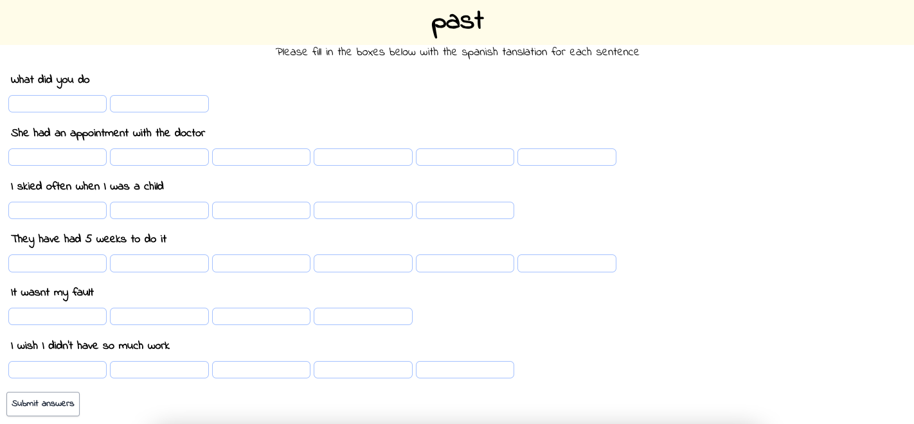
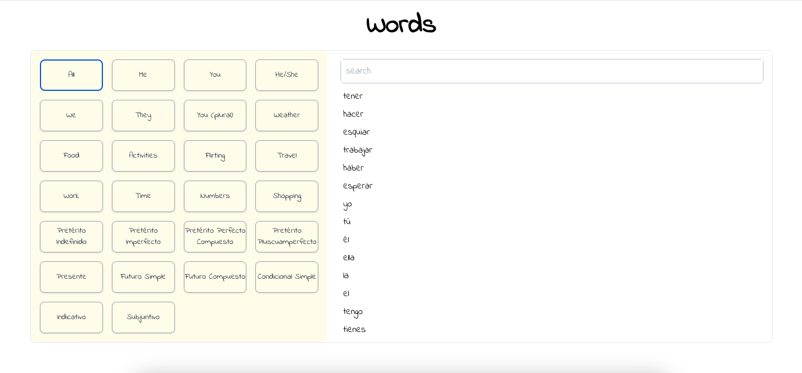
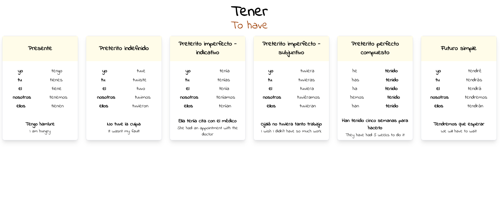

# Spanish Project frontend

### Technologies used

- React 18.2
- Axios
- Jest
- Tailwind CSS
- Redux
- Deployed with netlify

### Activity testing past tense sentences

It takes all sentences with the correct theme (in this case past tense) and takes a random selection of 15 of them

### List of words

Includes a list of categories and an input box to narrow down your search. When you click on the page it will take you to a page like the verb page below

### Verb page

Shows you how to use it with different tenses and pronouns, includes an example sentence at the bottom

## Netlify link -

https://spanish-project.netlify.app
