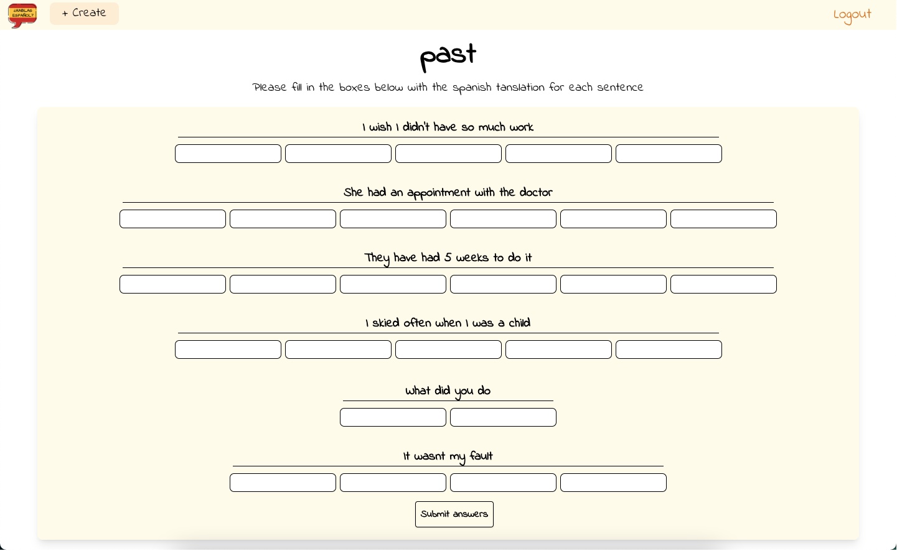

# Spanish Project frontend

## Technologies used

- React 18.2
- Axios
- Jest
- Tailwind CSS
- Redux
- Deployed with netlify

## Netlify link -

https://spanish-project.netlify.app

To log in as an admin -

```
Username: admin1
Password: qweqweqwe
```

## Search List

I have created a place I can look at all the information I have learnt and can search by language, theme, by inputting text, and by searching words/sentences. All in one list.


I did this by using a simple filter to search by the searchbox input value, but the `list` dynamically changes between Words and sentences, and the `searchColumn` also changes depending on if English or Spanish is chosen.

```js
filteredValues = list.filter((value) =>
  value[searchColumn].toLowerCase().includes(searchFilter.toLowerCase())
);
```

`filteredValues` is then filtered again if a theme is chosen.

## Game Component

I have created a reusable game component, used for each type of game. It takes the games theme (in this case past tense) and makes a request for a random selection of 15 sentences with that theme. It then displays the english translation for you to translate to spanish



Once the game is finished it creates a game score record which takes the user ID, game ID and users score.

### Verb page

Shows you how to use the verb with different tenses and pronouns, includes an example sentence at the bottom


